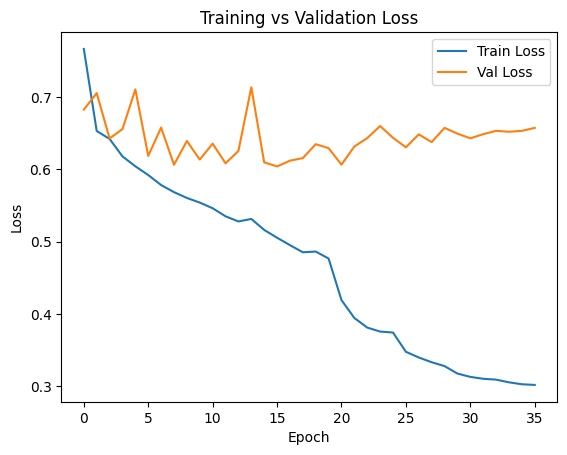

# Facial Expression Classification (FER)

This project focuses on building a deep learning model for **facial expression recognition** using PyTorch. The goal is to classify grayscale facial images into three emotion categories: **Anger (0), Happiness (1), and Sadness (2)**.

---

## Dataset

The dataset is provided from the **CS 4210 SP26 Kaggle competition**.

- Each image is **48×48 grayscale**, stored as **2304 pixel values** in CSV format
- Labels:
  - `0` → Anger  
  - `1` → Happiness  
  - `2` → Sadness  

### Data Split
- **80% Training**
- **20% Validation**
- Stratified split (`random_state=42`) to preserve class distribution

---

## Data Preprocessing & Augmentation

### Training Transformations
- Resize: `48×48 → 224×224`
- Convert grayscale → **3 channels** (for pretrained models)
- Random Horizontal Flip (`p=0.5`)
- Random Rotation (8°)
- Normalize using ImageNet statistics

### Validation Transformations
- Resize to `224×224`
- Normalize only (no augmentation)

---

## Model Architecture

- **Backbone:** ResNet-18 (pretrained on ImageNet)
- Final layer replaced:
  FC(512 → 3)

- Entire model is **fine-tuned end-to-end**

---

## Training Setup

### Loss Function
- CrossEntropyLoss with **label smoothing (ε = 0.1)**

### Optimizer
- Adam
- Learning rate: `1e-3`
- Weight decay: `1e-4`

### Scheduler
- ReduceLROnPlateau
- Reduces LR by factor of 0.5 if validation accuracy plateaus

---

## Training Strategy

- Maximum epochs: **100**
- Early stopping with patience = **15**
- Best model saved based on **validation accuracy**

---
## Results

### Accuracy Trends
- Training accuracy steadily increased to **~99%**
- Validation accuracy peaked at approximately **83–84%**
- Training vs Validation Accuracy

This gap indicates **moderate overfitting**, which was mitigated using:
- data augmentation
- label smoothing
- weight decay
- early stopping

### Loss Behavior
- Training loss consistently decreased
- Validation loss improved initially, then plateaued and slightly increased
- Training vs Validation Loss

This confirms that:
- the model learns strong features early
- further training mainly leads to **overfitting rather than generalization gains**

### Confusion Matrix

#### Key Observations:
- **Happiness (Class 1)** is the easiest class to classify
- Most errors occur between:
- **Anger ↔ Sadness**
- This suggests that subtle facial differences between these emotions are harder to capture

---

## DataLoader Configuration

- Batch size: **64**
- Shuffle: training only
- Device: **GPU (CUDA)** when available

---

## Key Insights
- Transfer learning with ResNet significantly improves performance over a custom CNN
- Fine-tuning the entire model performs better than training only the classifier head
- Small, controlled augmentation is more effective than aggressive transformations
- Early stopping is critical due to rapid overfitting

*Future Improvements:*
- Try stronger architectures (e.g., EfficientNet)
- Apply cross-validation
- Use ensemble methods
- Explore class balancing techniques
